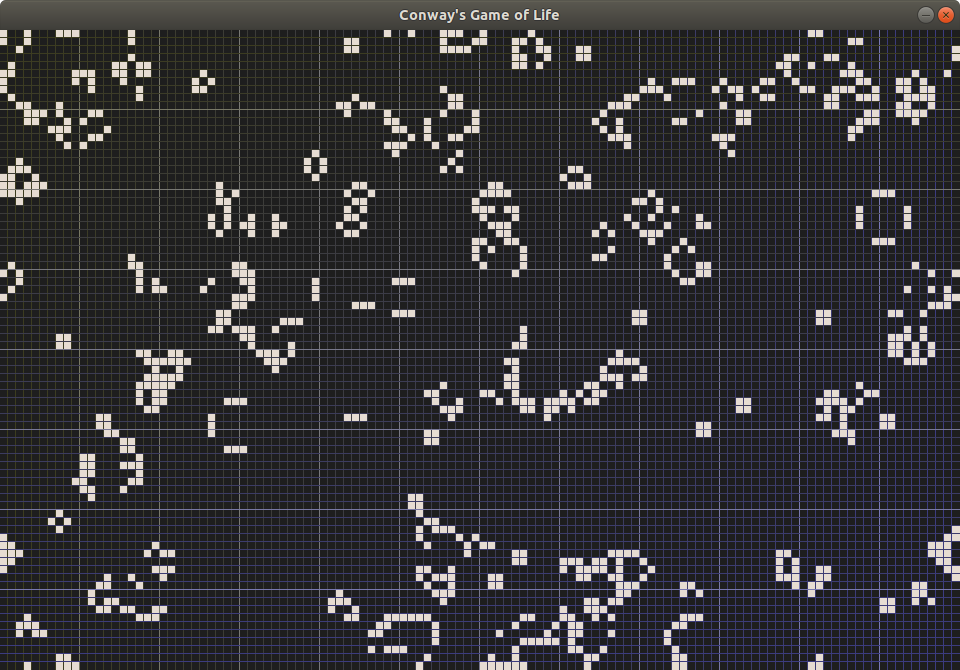

# Conway-s-Game-of-Life

Implementation of classic [Conway's game of life](https://en.wikipedia.org/wiki/Conway%27s_Game_of_Life) on toroidal field.

### Rules
The universe of the Game of Life is an infinite, two-dimensional orthogonal grid of square cells, each of which is in one of two possible states, alive or dead, (or populated and unpopulated, respectively).  
At each step, every cell interacts with its neighbours (horizontally, vertically, or diagonally adjacent cells):  
1 - Any live cell with fewer than two live neighbors dies, as if by under population;  
2 - Any live cell with two or three live neighbors lives on to the next generation;  
3 - Any live cell with more than three live neighbors dies, as if by overpopulation;  
4 - Any dead cell with exactly three live neighbors becomes a live cell, as if by reproduction.  
The initial pattern constitutes the seed. The rules continue to be applied repeatedly to create further generations. 

### Controls

Mouse scroll up/down: change simulation speed, slowing it down enough will stop execution.  
Mouse left click: activate cell  
Mouse right click: deactivate cell  

'E' key: empty field (no active cells)  
'R' key: random field (random live cells)  
'G' key: enable "God's touch" mode - on each step, a single random cell is selected and its status switched. It allows to create constantly evolving landscapes.
